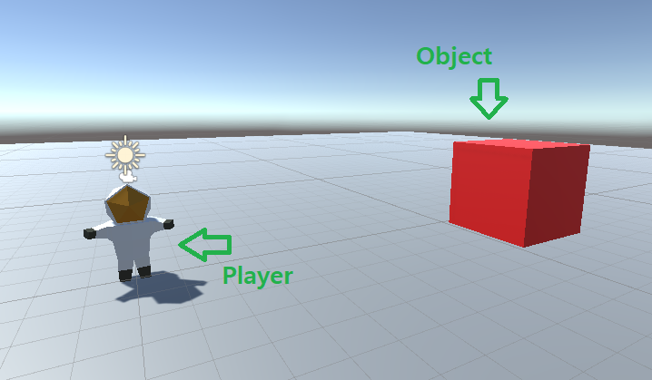
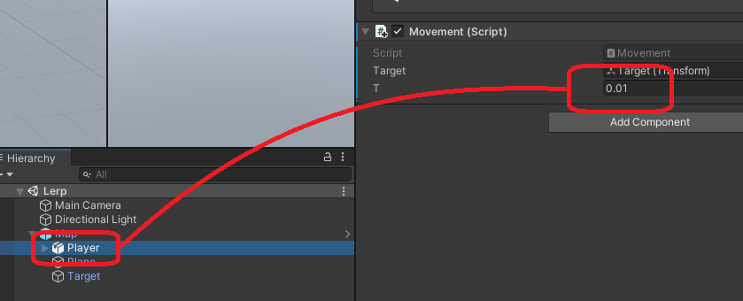

<hr/>

<p>Player Object를 Target의 위치로 이동시키는 방법에 대해 알아본다.</p>



<hr/>

### 1) Set Position


<p>Player의 position vector를 Target의 position vector로 지정하는 방법.</p>

```c#
using System.Collections;
using System.Collections.Generic;
using UnityEngine;

public class Movement : MonoBehaviour
{
    public Transform target;

    void Update()
    {
        transform.position = target.position;
    }
}
```


#### 실행 결과


*Player Object를 선택하고 위치를 변경해보려고 하면, 변경되지 않는다. 대신 Target Object의 위치를 변경하면 동시에 Player의 위치도 같이 바뀐다.*
<hr/>


### 2) Lerp

<p>Player Object 위치와 Target의 위치를 백분율(t)만큼 선형 보간식으로 이동 시키는 방법</p>


```c#
using System.Collections;
using System.Collections.Generic;
using UnityEngine;

public class Movement : MonoBehaviour
{
    public Transform target;
    public float t;


    void Update()
    {
        Vector3 a = transform.position;
        Vector3 b = target.position;
        transform.position = Vector3.Lerp(a, b, t);
    }
}
```




#### 실행 결과


*Movement 스크립트의 t 값에 따라 이동되는 속도가 달라진다. Set Position 방식보다 더 부드럽게 움직이는 것이 특징이다.*
<hr/>


### 3) MoveToward

<p>Player Object 위치와 Target의 위치를 지정된 속도로 일정하게 움직이는 방법</p>


```c#
using System.Collections;
using System.Collections.Generic;
using UnityEngine;

public class Movement_MoveToward : MonoBehaviour
{
    public Transform target;
    public float speed;


    void Update()
    {
        Vector3 a = transform.position;
        Vector3 b = target.position;
        // speed 값으로 일정하게 이동 - 매끄럽지 않음
        transform.position = Vector3.MoveTowards(a, b, speed);
    }
}
```


#### 실행 결과


*Movement 스크립트의 Speed 값에 따라 이동되는 속도가 달라진다. 일정한 속도로 움직이기 때문에 움직임이 매끄럽지 않다.*
<hr/>